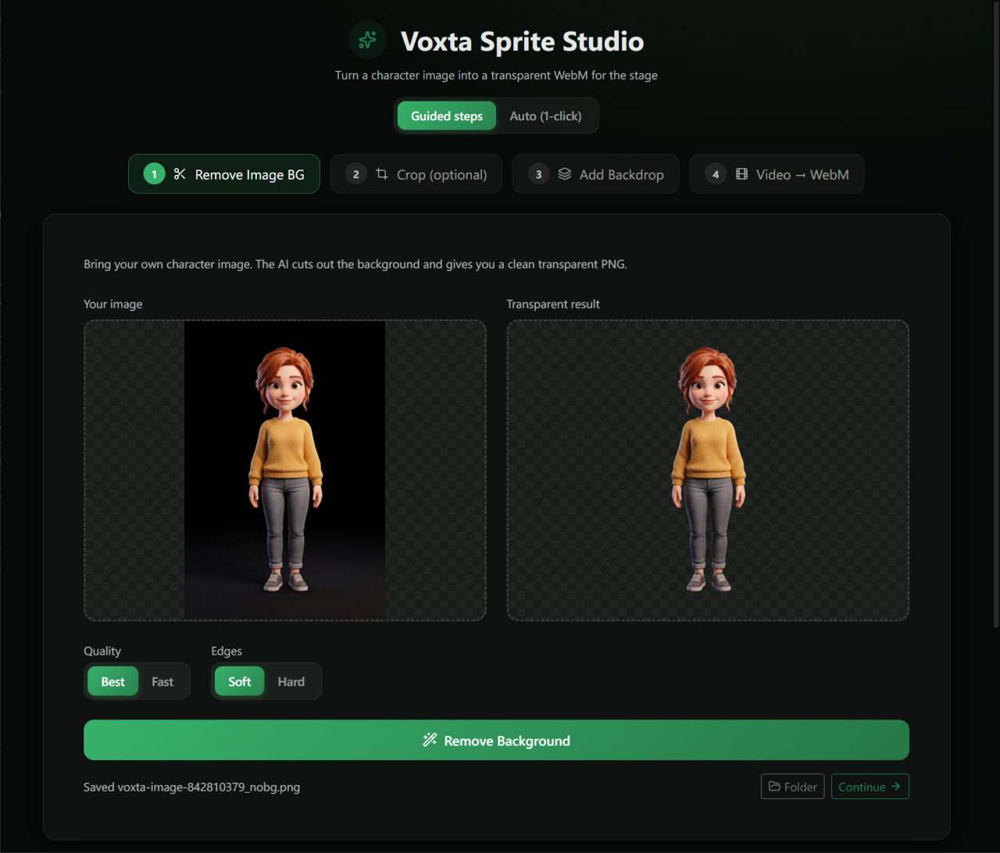

# Voxta Sprite Studio

Turn a character image into a transparent **WebM** ready for Voxta's stage / visual-novel
view - AI background removal, cropping, a green/black backdrop for video generators, and
one-click chroma-key to a clean transparent video. Batch and one-click auto modes included.



## What it does

The pipeline (image generation and video generation happen in your tools of choice):

| Step | Input | Output | Engine |
|------|-------|--------|--------|
| 1. Remove Image BG | your character image | transparent PNG | InSPyReNet (`transparent-background`) |
| 2. Crop (optional) | transparent PNG | tightly framed PNG | interactive crop / auto-trim |
| 3. Add Backdrop | transparent PNG | green/black PNG (feed to your video generator) | canvas composite |
| 4. Video -> WebM | green/black video | transparent `.webm` | ffmpeg chroma/black key |

Each step's output flows into the next. There is also an **Auto (1-click)** mode that batches
images through background removal + backdrop (with optional trim) in one go, and independent
stage toggles so you can, for example, only add a green backdrop to already-transparent art.

All outputs land in a `sprite-studio-output` folder next to your source files.

## Download

Grab the latest **installer** or **portable** build from the
[Releases](https://github.com/voxta-ai/voxta-sprite-studio/releases) page.

Nothing else to install - the app is self-contained:

- **ffmpeg** is bundled.
- **Background removal** provisions its own isolated Python environment on first use
  (downloads a standalone Python + `transparent-background`/InSPyReNet into the app's data
  folder). It never touches your system Python. If an NVIDIA GPU is detected, the CUDA build
  of torch is installed for faster removal; otherwise it falls back to CPU.

## Development

```bash
npm install
npm run electron:dev   # starts Vite + Electron together
```

To skip the first-run Python provisioning during development and reuse an existing Python that
already has `transparent-background` installed:

```powershell
# PowerShell
$env:SPRITE_STUDIO_PYTHON = "C:\path\to\python.exe"
```

Force the CPU torch build even when a GPU is present with `SPRITE_STUDIO_FORCE_CPU=1`.

## Build

```bash
npm run electron:build   # installer + portable exe in dist_electron/
```

Pushing a `v*` tag triggers the release workflow, which builds the Windows artifacts and
drafts a GitHub Release with them attached.

## Tech

Electron + SolidJS + TypeScript + Bootstrap + SCSS, ffmpeg (bundled), and InSPyReNet via
`transparent-background` (provisioned with [uv](https://github.com/astral-sh/uv)).

## License

MIT (see `LICENSE`). Bundled/third-party components and their licenses are listed in
[`THIRD_PARTY_NOTICES.md`](THIRD_PARTY_NOTICES.md).
